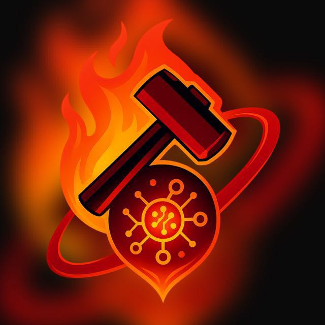

<!-- ✨ Astral Force - README de la organización ✨ -->

#  A S T R A L · F O R G E

### "Donde el código se une con la creación — forjando inteligencia, arte y propósito."

---

## 🧩 Sobre Nosotros

**Astral Forge** es una tripulación creativa-tecnológica de nueva generación — un colectivo multidisciplinario que une **ciencia de datos, inteligencia artificial, diseño, psicología y filosofía** para construir sistemas que *tengan alma*.

Somos exploradores del universo digital:  
forjamos algoritmos, diseñamos experiencias inmersivas y estudiamos cómo la tecnología puede expandir el potencial humano.

> 🧠 *“No solo escribimos código, forjamos significado.”*

---

## ⚙️ Áreas de Enfoque

| Área | En qué nos enfocamos | Roles clave |
|------|-----------------------|--------------|
| 🧠 **Técnica** | IA, Machine Learning, Ingeniería de Datos, Backend/Frontend | Científico de Datos, MLOps, Backend Dev |
| 🎨 **Creativa** | Diseño, Música, Storytelling | Diseñador Gráfico, Comunicador, Músico |
| 🌍 **Humana** | Psicología, Ética, Bienestar | Psicóloga, Filósofo, Ético en IA |
| 📚 **Educativa** | Mentoría, Aprendizaje, Investigación | Educador, Mentor, Investigador |
| 🚀 **Estratégica** | Liderazgo, Cultura, Exploración | Visionario, Organizador, Coordinador |

---

## 🔥 Proyectos Principales

### 🧱 **Astral Database System**
> Sistema de base de datos adaptable a cualquier entorno — desde minimarkets hasta sistemas de videojuegos.  
> 🧩 _Diseñado para la versatilidad y la simplicidad._

---

## 🧭 Visión

Creemos en **una nueva generación de creadores digitales** — humanos y AIs colaborando en armonía.  
Nuestra meta es forjar una cultura de **innovación, conciencia y libertad creativa**, donde la curiosidad sea el motor del progreso.

> _“Del código al cosmos, todo está conectado.”_

---

## ⚡ Tech Stack & Tools

### 💻 Lenguajes de Programación

---

### 📊 Ciencia de Datos & Machine Learning

---

### 📈 Visualización de Datos

---

### 🗄️ Bases de Datos & Cloud

---

### ⚙️ Frameworks & Backend

---

### 🎨 Frontend & UI

---

### 🧰 Herramientas de Desarrollo

---

## 🌌 Únete a la Tripulación

Si compartes nuestra visión de unir creatividad e inteligencia — bienvenido a bordo, explorador 🪐

---

  © 2025 Astral Force. Creado por soñadores, ingenieros y artistas — con un toque de polvo estelar ✨

